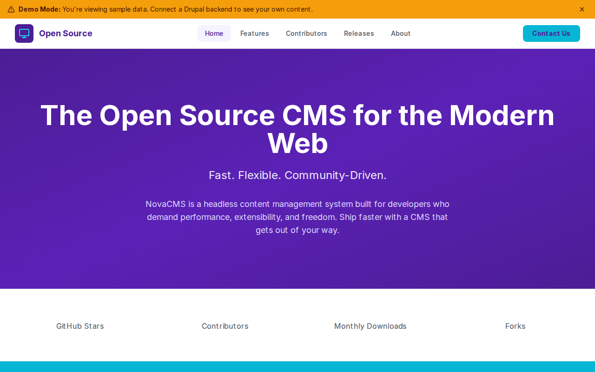

# Decoupled Open Source

A headless Drupal + Next.js starter kit for open source project websites. Built for maintainers, developer communities, and open source organizations who need a modern site to showcase features, contributors, releases, and documentation.



## Features

- **Features** -- Showcase project capabilities with categories, version info, and feature images
- **Contributors** -- Profile maintainers and contributors with roles, GitHub usernames, and contribution counts
- **Releases** -- Publish changelogs with version numbers, release types (major/minor/patch/beta), and download links
- **Homepage** -- Dynamic hero with project stats (GitHub stars, contributors, monthly downloads, forks) and CTA
- **Basic Pages** -- Static content for About, Documentation, Contributing Guide, and more
- **Demo Mode** -- Ships with sample content from a fictional CMS project (NovaCMS) for instant preview

## Quick Start

```bash
# Clone the starter
npx degit nicoschi/decoupled-open-source my-oss-site
cd my-oss-site

# Install dependencies
npm install

# Run interactive setup
npm run setup

# Start development
npm run dev
```

Open [http://localhost:3000](http://localhost:3000) to see the demo site.

## Manual Setup

1. **Create a Drupal Space** at [Decoupled](https://app.decoupled.dev)

2. **Import Content** -- Use the DC Import API or MCP tools to import `data/open-source-content.json`. This creates:
   - 4 features: GraphQL API, Plugin Architecture, Edge Caching & CDN, Flexible Authentication
   - 3 contributors: Elena Vasquez (creator), Kai Tanaka (API maintainer), Amara Osei (DevEx & docs)
   - 3 releases: v3.0.0 Aurora (major), v2.12.0 (minor), v2.11.3 (security patch)
   - 3 pages: About NovaCMS, Documentation, Contributing Guide

3. **Configure Environment Variables** -- Copy `.env.local.example` to `.env.local` and fill in your Drupal credentials:
   ```
   NEXT_PUBLIC_DRUPAL_BASE_URL=https://your-space.decoupled.website
   DRUPAL_CLIENT_ID=your-client-id
   DRUPAL_CLIENT_SECRET=your-client-secret
   DRUPAL_REVALIDATE_SECRET=your-revalidate-secret
   ```

4. **Generate the GraphQL schema** and start developing:
   ```bash
   npm run generate-schema
   npm run dev
   ```

## Content Types

### Feature
Key features and capabilities of the open source project.

| Field | Type | Description |
|-------|------|-------------|
| Category | Term (feature_categories) | Core, plugins, integrations, developer-tools, performance |
| Icon Name | String | Icon identifier for display |
| Image | Image | Feature illustration |
| Version Added | String | Version where the feature was introduced |

### Contributor
Open source project contributors and maintainers.

| Field | Type | Description |
|-------|------|-------------|
| Role | String | Contributor's role (e.g., "Core Maintainer - API") |
| GitHub Username | String | GitHub handle |
| Contributions | Integer | Total contribution count |
| Photo | Image | Profile photo |

### Release
Project releases and changelogs.

| Field | Type | Description |
|-------|------|-------------|
| Version Number | String | Semantic version (e.g., "3.0.0") |
| Release Date | DateTime | Publication date |
| Release Type | Term (release_types) | Major, minor, patch, beta, release-candidate |
| Download URL | String | Link to release assets |
| Latest Release | Boolean | Whether this is the current stable release |

### Homepage
Project homepage with hero, stats, featured items, and call-to-action.

### Basic Page
Static content pages (About, Documentation, Contributing Guide, etc.).

## Customization

- **Styling** -- Tailwind CSS configuration in `tailwind.config.js`. The starter uses a violet/cyan color palette.
- **Navigation** -- Edit `app/components/Header.tsx` to add or remove nav items.
- **Footer** -- Customize links and community channels in `app/components/HomepageRenderer.tsx`.
- **Taxonomies** -- Feature categories and release types are configurable via Drupal taxonomy vocabularies.

## Demo Mode

The starter ships with a `DemoModeBanner` component that displays a banner when running in demo mode. To remove it for production, delete the import and component from `app/layout.tsx`.

## Deployment

Deploy to any platform that supports Next.js:

- **Vercel** -- Zero-config deployment. Set environment variables in the Vercel dashboard.
- **Netlify** -- Use the Next.js adapter.
- **Self-hosted** -- Run `npm run build && npm start`.

## Documentation

- [Decoupled Drupal Docs](https://docs.decoupled.dev)
- [Next.js Documentation](https://nextjs.org/docs)
- [Tailwind CSS](https://tailwindcss.com/docs)

## License

MIT
